# SPECS: Jobs Module
**Dominio:** `/src/modules/jobs`
**Referencias:** [escrow-logic.md](../../docs/explanation/escrow-logic.md), [currency-exchange-rates.md](currency-exchange-rates.md), [money-rules.md](../rules/money-rules.md), [dispute-module.md](dispute-module.md).

## 1. Contexto

El módulo Jobs es el **núcleo transaccional** de Nexos: publicación por el cliente, aceptación por profesional, pricing por líneas, change orders y ciclo de vida hasta `CLOSED`. Crea el Escrow en `accept` y delega fondeo/liberación a EscrowModule.

**v1:** publicación directa (sin `JobQuote` multi-pro). Urgency convierte a Job vía adapter (`createFromUrgency`) en PR futuro.

## 2. State Machine (Job)

```mermaid
stateDiagram-v2
  [*] --> PENDING: CLIENT publica
  PENDING --> CANCELLED: CLIENT cancela
  PENDING --> ACCEPTED: PRO acepta + createPending Escrow
  ACCEPTED --> IN_PROGRESS: inicio trabajo
  ACCEPTED --> CANCELLED: reglas pre-HELD
  IN_PROGRESS --> COMPLETED: PRO finaliza
  COMPLETED --> CLOSED: CLIENT aprueba o timer 48h
  note right of COMPLETED: Ventana conformidad; disputas; Escrow HELD
```

| Estado | Descripción |
|--------|-------------|
| `PENDING` | Publicado, sin profesional |
| `ACCEPTED` | Pro asignado; Escrow `PENDING` (sin pago aún) |
| `IN_PROGRESS` | Trabajo en curso; Escrow `HELD` tras webhook |
| `COMPLETED` | Pro marcó fin; `completedAt` + `approvalDeadline`; timer BullMQ 48h hábiles |
| `CLOSED` | Conformidad o aceptación silenciosa; Escrow `RELEASED` |
| `CANCELLED` | Cancelado antes de cierre |

`PENDING_APPROVAL` en schema es **legacy alias** del periodo post-`COMPLETED`; código nuevo usa solo `COMPLETED` + `approvalDeadline`.

## 3. Pricing

| Campo / tabla | Uso |
|---------------|-----|
| `pricingMode` | `ESTIMATE` \| `FIXED` |
| `JobPriceLine` | `LABOR`, `MATERIAL`, `OTHER` + `amountCents` en moneda del Job |
| `totalAmountCents` | Suma vigente de líneas aprobadas |
| `JobChangeOrder` | Pro propone extras → cliente `APPROVE`/`REJECT` → recalcula total |

**Change order con Escrow `HELD`:** delta en UYU al aprobar (conversión si Job en USD con tasa BCU vigente). Pago complementario vía pasarela en PR dedicado; v1 documenta cálculo y persiste `heldAmountCents` actualizado tras webhook adicional o ajuste manual SUPER_ADMIN (MVP: recálculo en approve + exigir re-fondeo si delta > 0).

## 4. Moneda

- `currencyId` → catálogo `UYU` \| `USD` ([currency-exchange-rates.md](currency-exchange-rates.md)).
- Montos de líneas/total en **minor units de la moneda del Job**.
- **Pasarela solo UYU:** al fondear, `EscrowService` convierte USD→UYU con tasa BCU **venta** del día; snapshot en `exchangeRateId`.

## 5. Ubicación

Campos en `Job`: `addressLine`, `countryId`, `stateId`, `cityId`, `neighborhoodId`, `latitude`, `longitude` (opcional resolve vía [geo-module.md](geo-module.md)).

## 6. APIs

Prefijo `/api/jobs`. JWT salvo rutas `@Public()` futuras.

| Método | Ruta | Rol | Notas |
|--------|------|-----|-------|
| POST | `/` | `CLIENT` | Crear `PENDING` + líneas + geo + `currencyCode` |
| GET | `/mine` | `CLIENT` | Listado paginado |
| GET | `/:id` | CLIENT o pro asignado | Detalle + líneas + change orders |
| GET | `/available` | `INDEPENDENT_PRO` | `PENDING` (v1 sin radio; filtro categoría) |
| POST | `/:id/accept` | `INDEPENDENT_PRO` | → `ACCEPTED` + escrow; body opcional `payoutAccountId` (ver [payout-accounts-module.md](payout-accounts-module.md)) |
| GET | `/:id/escrow/payout-attempts` | CLIENT / pro del job | Historial `PayoutAttempt` |
| POST | `/:id/escrow/payout/retry` | `SUPER_ADMIN` | Reintento si `payoutStatus=FAILED` |
| PATCH | `/:id/status` | pro / CLIENT | Transiciones válidas |
| POST | `/:id/change-orders` | `INDEPENDENT_PRO` | Propone extras |
| PATCH | `/:id/change-orders/:coId` | `CLIENT` | Aprueba/rechaza |
| POST | `/:id/complete` | `INDEPENDENT_PRO` | → `COMPLETED` + timer 48h |
| POST | `/:id/approve-completion` | `CLIENT` | → `CLOSED` + `release` |

## 7. RBAC

| Recurso | Guard | Regla |
|---------|-------|-------|
| Mutaciones cliente | `SupabaseAuthGuard` + `RolesGuard` | `@Roles(CLIENT)` + `job.clientId === user.id` |
| Mutaciones pro | `SupabaseAuthGuard` + `RolesGuard` | `@Roles(INDEPENDENT_PRO)` + `job.professionalId` del perfil del user |
| Lectura | JWT | Ownership cliente o pro asignado |

**v1:** solo `INDEPENDENT_PRO` acepta (no `COMPANY_EMPLOYEE`).

**KYC (v1):** documentar política — recomendado bloquear `accept` si `kycStatus !== VERIFIED` (configurable).

## 8. Planes y entitlements

| Capability | Cuándo |
|------------|--------|
| N/A v1 | Sin límite de jobs activos por plan en esta entrega |

Registrar en spec para v2: `jobs.active.max` por plan.

## 9. Errores RFC 7807

| code | HTTP | Cuándo |
|------|------|--------|
| `JOB_NOT_FOUND` | 404 | id inexistente |
| `JOB_ACCESS_DENIED` | 403 | Sin ownership |
| `JOB_INVALID_STATUS_TRANSITION` | 409 | State machine |
| `JOB_ALREADY_ASSIGNED` | 409 | accept en job no PENDING |
| `JOB_CURRENCY_INVALID` | 400 | currencyCode no activo |
| `JOB_PRICE_LINES_REQUIRED` | 400 | Sin líneas al crear |
| `JOB_CHANGE_ORDER_NOT_FOUND` | 404 | — |
| `JOB_CHANGE_ORDER_INVALID_STATUS` | 409 | — |

## 10. Gate de destino de cobro (accept)

Antes de `assignProfessional`, `PayoutAccountsService.assertProfessionalCanAcceptJob`:

1. Al menos una cuenta **activa** del profesional.
2. Exactamente una cuenta **primary** activa.
3. `payoutAccountId` en body (opcional): debe pertenecer al profesional y estar activa; si se omite, se usa la primary.

Tras `accept`: `assignJobPayout` + `setEscrowPayoutAccount` con el destino resuelto.

Errores: `PAYOUT_ACCOUNT_REQUIRED`, `PAYOUT_PRIMARY_REQUIRED`, `PAYOUT_ACCOUNT_NOT_OWNED`, `PAYOUT_ACCOUNT_NOT_FOUND`.

## 11. Payout tras liberación

`approve-completion` (y aceptación silenciosa) llama `EscrowService.releaseForJob` → `EscrowPayoutService.executePayoutForJob` (mock MP v1). El job pasa a `CLOSED` cuando el cliente aprueba; el dinero al pro queda en `EscrowTransaction.payoutStatus` (`SUCCEEDED` \| `FAILED`).

## 12. Integraciones

- **EscrowModule:** `createPending`, `fundEscrow`, `release`, `scheduleSilentAcceptance`, `cancelSilentAcceptance`, payout vía `EscrowPayoutService`
- **PayoutAccountsModule:** gate accept, snapshot de destino, validación gateway
- **ExchangeRatesModule:** `getLatestUsdRate()`, `convertJobAmountToUyuCents()`
- **Portfolio:** solo `CLOSED` para vínculo (sin cambio de contrato)

## 13. Tests

- Unit: service, repository, state transitions, payout gate y rutas escrow payout
- E2E: publicar → configurar payout → aceptar → complete → approve; publicar USD + mock tasa
