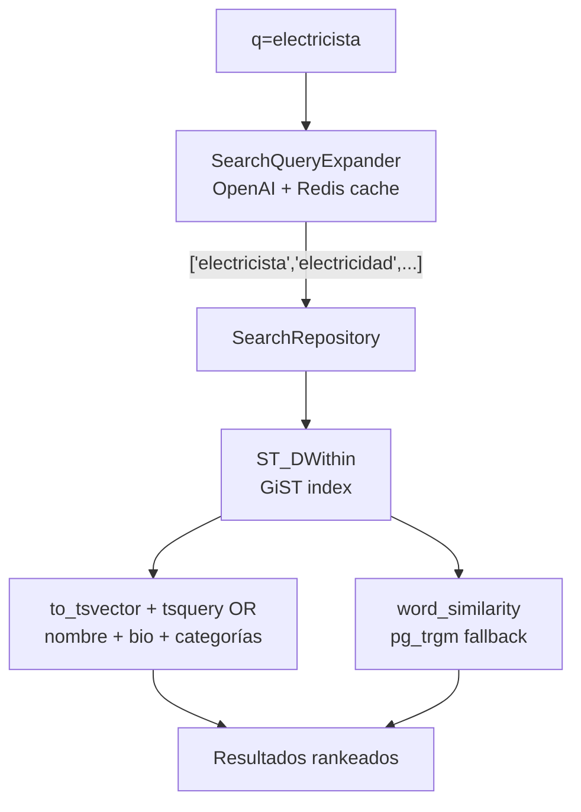

# SPECS: Search & Matching Module
**Dominio:** `/src/modules/search`
**Referencia cruzada:** `docs/explanation/architecture.md` (PostGIS), `docs/reference/api-standards.md` (paginación).

## 1. Contexto del Módulo

Este módulo expone la búsqueda de profesionales disponibles para el cliente. Es el punto de entrada para las verticales de **Hogar y Oficios** (cotización) y **Servicios Profesionales** (booking). No aplica a Urgencias, que tiene su propio flujo de dispatch.

La inteligencia del módulo combina:
- **PostGIS** para filtro geoespacial (radio).
- **Full Text Search** en español sobre nombre, bio y categorías.
- **Expansión de query con IA** (OpenAI) para sinónimos y variantes morfológicas.
- **pg_trgm** (`word_similarity`) como fallback fuzzy.

---

## 2. Motor Tecnológico Obligatorio

- **PostGIS:** Toda operación geoespacial ocurre en la base de datos. **Prohibido** calcular distancias en JavaScript/TypeScript.
- **Prisma Raw Queries:** Para queries con PostGIS y FTS se usa `prisma.$queryRawUnsafe` con parámetros posicionales. Prisma ORM nativo no soporta operadores geoespaciales.
- **pg_trgm:** Extensión habilitada en migración `20260520030000_add_pg_trgm_extension`. Usada solo como fallback OR sobre el subconjunto ya filtrado por radio.

---

## 3. Motor de Texto Inteligente (3 capas)



### Capa 1 — Expansión IA (`SearchQueryExpanderService`)

- Antes de buscar, `q` se expande vía OpenAI (`gpt-4o-mini`) a sinónimos/variantes **y oficios/categorías** cuando el usuario describe una tarea (ej. `arreglar baño` → `plomero`, `Plomería`).
- El system prompt se construye **dinámicamente** con las categorías de la BD (`src/config/search-expansion-prompt.ts`). Al arrancar, el expander lee todas las categorías; al crear/editar/borrar categorías vía admin, `CategoriesService` invoca `reloadCategories()` y el prompt se reconstruye sin reiniciar.
- Resultado cacheado en Redis (`search:expand:{sha256}`) con TTL 7 días.
- Si OpenAI falla o timeout (2s): degradación graceful → `[q]` original.
- Circuit breaker (opossum) evita llamadas repetidas cuando el proveedor está caído.
- Feature flag: `SEARCH_EXPANSION_ENABLED` (default `true`).

### Capa 2 — FTS con categorías

El vector de texto incluye **nombre + bio + nombres de categorías** del profesional:

```sql
to_tsvector('spanish',
  fullName || ' ' || bio || ' ' || string_agg(category.name)
)
@@ (plainto_tsquery('spanish', $term1) || plainto_tsquery('spanish', $term2) || ...)
```

Los términos expandidos se combinan con OR. Ejemplo: `electricista` expande a `electricidad` → matchea categoría "Electricidad".

### Capa 3 — Fallback pg_trgm

Si FTS no matchea, `word_similarity(q_original, search_text) > threshold` actúa como OR adicional. Cubre errores de tipeo y variantes no cubiertas por stemming.

---

## 4. Query SQL Base (implementación actual)

```sql
SELECT
  pp.id,
  u.id AS "userId",
  u."fullName",
  pp.bio,
  pp."experienceYears",
  pp."averageRating",
  pp."isAvailable",
  ST_Distance(pp.location, ST_SetSRID(ST_MakePoint($lng, $lat), 4326)::geography) AS distance_m,
  CASE WHEN to_tsvector(...) @@ (expanded_tsquery) THEN 0 ELSE 1 END AS relevance_rank
FROM "ProfessionalProfile" pp
JOIN "User" u ON u.id = pp."userId"
WHERE
  pp."deletedAt" IS NULL
  AND u."deletedAt" IS NULL
  AND pp."isAvailable" = true
  AND ST_DWithin(pp.location, point, $radiusMeters)
  AND (
    to_tsvector(...) @@ (expanded_tsquery)
    OR word_similarity($q_original, search_text) > $threshold
  )
ORDER BY relevance_rank ASC, distance_m ASC
LIMIT $limit OFFSET $offset;
```

**Ranking:** FTS exacto primero (`relevance_rank = 0`), luego trigram (`relevance_rank = 1`), ambos ordenados por distancia ascendente.

---

## 5. Controladores y Endpoints

### A. Endpoint: Buscar Profesionales
- **Ruta:** `GET /api/search/professionals`
- **Protección:** **Público** (`@Public()`). No requiere autenticación.
- **Query Params (`SearchQueryDto`):**
  - `latitude`: number, obligatorio.
  - `longitude`: number, obligatorio.
  - `radiusKm`: number, opcional (default 5, max 100).
  - `categoryId`: UUID, opcional.
  - `q`: string, opcional (activa expansión IA + FTS + trigram).
  - `page`, `limit`: paginación offset-based.
- **Respuesta:** `{ results, total, page, limit }` con `distanceMeters` por resultado.

---

## 6. Configuración (src/config/search.config.ts)

**Variables de entorno (operador puede cambiar entre entornos):**

| Variable | Default | Descripción |
|----------|---------|-------------|
| `SEARCH_DEFAULT_RADIUS_KM` | `5` | Radio por defecto en km |
| `SEARCH_DEFAULT_LIMIT` | `10` | Resultados por página |
| `SEARCH_FTS_DICTIONARY` | `spanish` | Diccionario PostgreSQL FTS |
| `SEARCH_EXPANSION_ENABLED` | `true` | Feature flag expansión IA |
| `SEARCH_EXPANSION_TTL_SECONDS` | `604800` | TTL cache Redis (7d) |
| `SEARCH_EXPANSION_TIMEOUT_MS` | `2000` | Timeout OpenAI |
| `SEARCH_EXPANSION_MODEL` | `gpt-4o-mini` | Modelo OpenAI |

**Constantes fijas (no env vars):** `defaultPage`, `maxTerms`, `maxTokens`, `cachePrefix`, `circuitBreaker.*`, `trgmThreshold`.

**System prompt:** construido dinámicamente desde la tabla `Category` (`buildSearchExpansionSystemPrompt()`). No es env var ni constante fija.

---

## 7. Excepciones Esperadas (RFC 7807)
- `400 Bad Request`: Coordenadas inválidas, radio fuera de rango.
- Respuesta vacía (`results: []`, `total: 0`) si no hay profesionales en el radio — **no** es 404.

---

## 8. Reglas de Código para el Agente
- **NUNCA** usar Prisma ORM nativo para queries con PostGIS. Usar `prisma.$queryRawUnsafe` con parámetros posicionales.
- **NUNCA** concatenar input del usuario en el string SQL.
- La expansión IA **nunca bloquea** la búsqueda: si falla, se usa `q` original.
- Actualizar Postman (`postman/nexos-api.postman_collection.json`) y `.http` (`http/08-search.http`) cuando cambien DTOs o endpoints.
